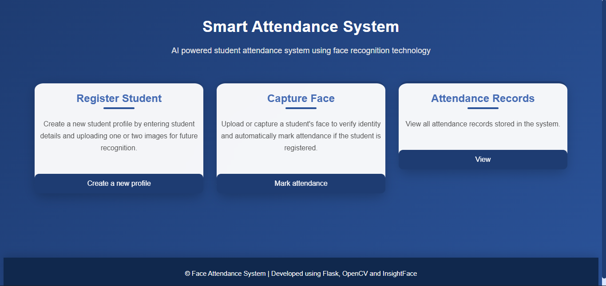
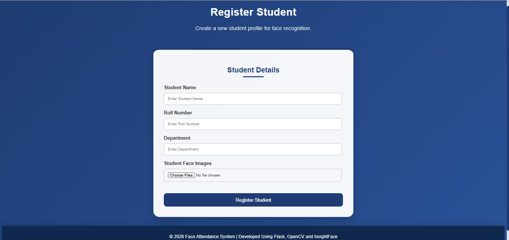
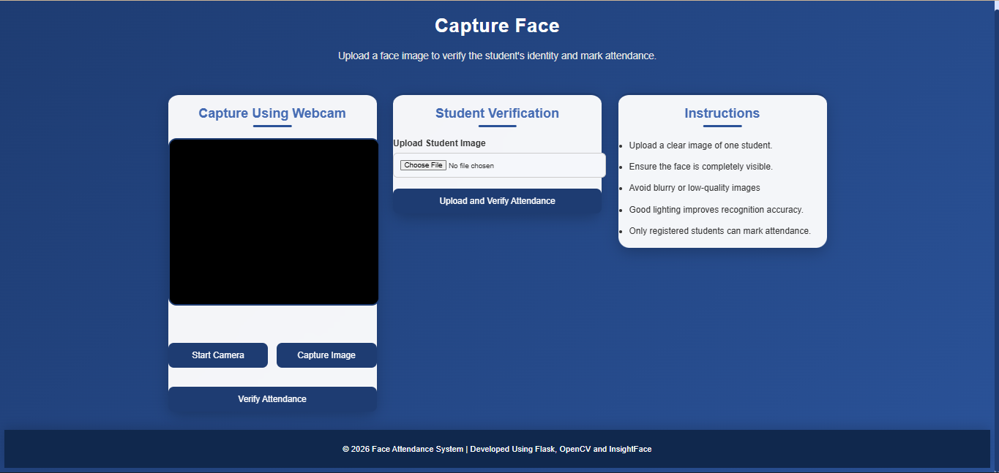
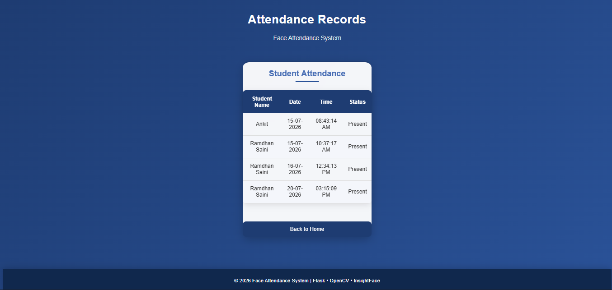

# Smart-Attendance-System
 
## Overview
The Smart Attendance System is an AI-powered web application developed using Flask, OpenCV, and InsightFace. The system automates student attendance management by recognizing faces from uploaded images or webcam captures. It eliminates the need for manual attendance marking and improves accuracy, efficiency, and reliability in educational environments.
The application allows administrators or instructors to register students, generate facial embeddings, recognize students in real time, and maintain attendance records automatically.

## Features
- Student registration using facial images
- Upload or capture face images through the web interface
- Automatic generation of facial embeddings
- Face recognition using InsightFace
- Automatic attendance marking
- Attendance record management
- User-friendly Flask-based web interface
- CSV-based attendance storage

## Technologies Used
Technology| Purpose
Python| Core programming language
Flask| Web framework
OpenCV| Image processing and face capture
InsightFace| Face recognition and embeddings
NumPy| Numerical operations
Pandas| Attendance data handling
HTML/CSS| Frontend interface
JavaScript| Client-side interactions
Pickle| Embedding storage

## Project Structure

SMART-ATTENDANCE-SYSTEM/
│── app.py
│── requirements.txt
│── README.md
│
├── data/
│   ├── attendance.csv
│   └── embeddings.pkl
│
├── dataset/
│   ├── Student1/
│   └── Student2/
│
├── model/
│   ├── face_model.py
│   ├── generate_embeddings.py
│   ├── recognize.py
│   └── similarity.py
│
├── static/
│   ├── css/
│   ├── js/
│   └── uploads/
│
├── templates/
│   ├── index.html
│   ├── profile.html
│   ├── capture.html
│   ├── attendance.html
│   └── result.html
│
└── utils/

## Clone the Repository
git clone https://github.com/yourusername/Smart-Attendance-System.git

## Running the Application
Start the Flask development server:
python app.py

## Usage
### 1. Register Student
- Enter the student's name.
- Upload one or more facial images.
- Create a new student profile.

### 2. Generate Face Embeddings
- The system extracts facial features from the uploaded images.
- Embeddings are stored in "embeddings.pkl".

### 3. Mark Attendance
- Upload or capture a face image.
- The system identifies the student.
- Attendance is automatically recorded.

### 4. View Attendance Records
- Access the attendance records page.
- View all stored attendance entries.

## System Workflow
1. Student registration with facial images
2. Face embedding generation
3. Storage of embeddings
4. Face recognition during attendance capture
5. Automatic attendance marking
6. Attendance record storage in CSV

## Key Advantages
- Reduces manual attendance effort
- Improves attendance accuracy
- Prevents proxy attendance
- Provides quick student identification
- Maintains digital attendance records
- Easy to deploy in educational institutions

## Future Enhancements
- Real-time webcam recognition
- Admin authentication and authorization
- Database integration (MySQL/PostgreSQL)
- Cloud deployment support
- Email or SMS notifications
- Mobile-responsive interface
- Attendance analytics dashboard
- Multi-classroom support

## Screenshots
### Home Page

### Register Student Page

### Mark Attendance Page

### Attendance Recordes Page

Author
Ramdhan Saini
GitHub: https://github.com/ramdhansaini

License
This project is developed for educational, academic, and learning purposes. It may be used and modified for personal or institutional projects with appropriate attribution.
